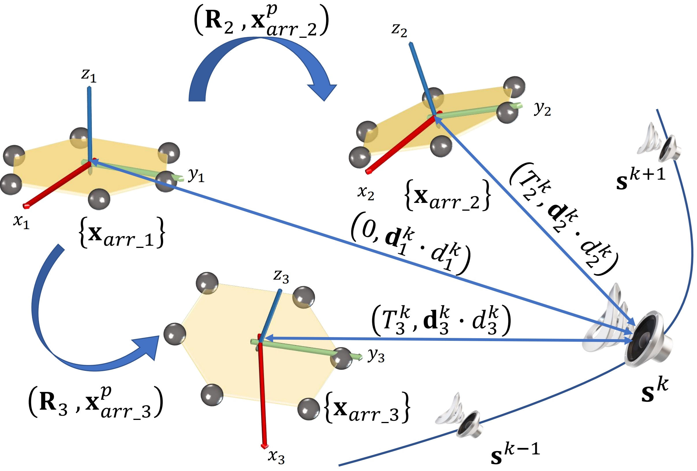
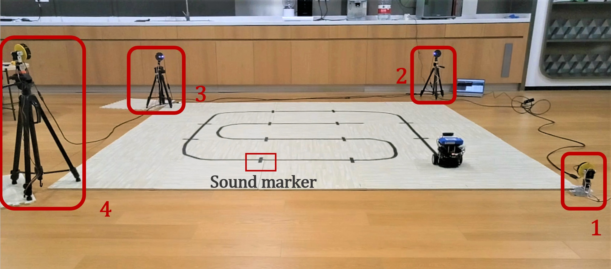
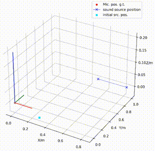
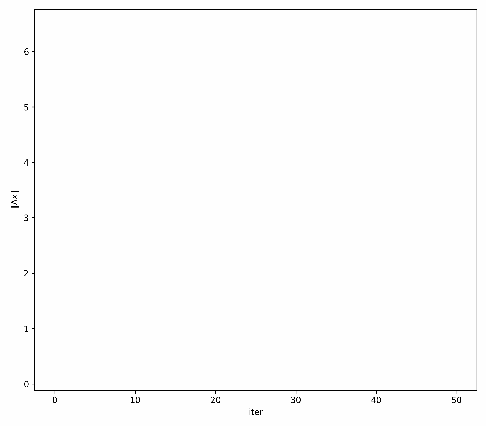

# SLAM-Based Joint Calibration of Multiple Asynchronous Microphone Arrays and Sound Source Localization
This is an open-source project aimed at calibrating the spatio-temporal extrinsic parameters of multi-microphone arrays.

<div align="center">
    
    
</div>

## Run the Examples:
```bash
pip install -r ./requirements.txt
python Multi_Mic_Arrays_Calibration.py
```
### Calibration process
<div align="center">
    
</div>

### Nonlinear optimization process

<div align="center">
    
</div>

## Real world Datasets(not essential)
The [dataset](https://pan.baidu.com/s/1rnOPAfSz1G1ROJz8OHQ7Nw?pwd=MCAL) records video and IMU information (stereo cameras + IMU) during the movement of the mobile robot, as well as sound audio captured by four microphone arrays.

Download [dataset](https://pan.baidu.com/s/1rnOPAfSz1G1ROJz8OHQ7Nw?pwd=MCAL) to YOUR_DATASET_FOLDER and decompress it. Then, move the ROS_data to ./tools/1_visual_processing/ROS_data and move audio to ./tools/2_audio_processing/audio.

Finally, use the script in the tools folder to process the data set to obtain the corresponding measurements.
## License
The source code and dataset are released under [GPLv3](http://www.gnu.org/licenses/) license.
## Acknowledgements
We use [vins fusion](https://github.com/HKUST-Aerial-Robotics/VINS-Fusion) for visual-inertial odometry and [speechbrain](https://github.com/speechbrain/speechbrain) for DOA estimation.
## Citation
Please, cite the paper if you use the microphone arrays calibration codes or data for your research.

```bibtex
@misc{2023observability,
  title={Observability Analysis of Graph SLAM-Based Joint Calibration of Multiple Microphone Arrays and Sound Source Localization},
  author={He, Yuanzheng and Wang, Jiang and Su, Daobilige and Nakadai, Kazuhiro and Wu, Junfeng and Huang, Shoudong and Li, Youfu and Kong, He},
  booktitle={2023 IEEE/SICE International Symposium on System Integration (SII)},
  pages={1--8},
  year={2023},
  organization={IEEE}
}
@article{2024calibration,
  title={SLAM-based Joint Calibration of Multiple Asynchronous Microphone Arrays and Sound Source Localization},
  author={Wang, Jiang and He, Yuanzheng and Su, Daobilige and Itoyama, Katsutoshi and Nakadai, Kazuhiro and Wu, Junfeng and Huang, Shoudong and Li, Youfu and Kong, He},
  journal={IEEE Transactions on Robotics},
  year={2024},
  publisher={IEEE}
}
```
